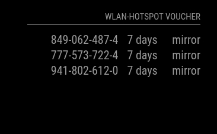

# MMM-UniFi-Voucher
A [MagicMirror²](https://magicmirro.builders) module for [UniFi Hotspot](https://unifi-network.ui.com/) Voucher



## Dependencies

## Installation

Go to your MAcigMirror's module folder:
````
cd ~/MagicMirror/modules
````

Clone this repository:
````
git clone https://github.com/......git
````
Add the module to the modules list in  your config file:

````javascript
{
    module: "MMM-UniFi-Voucher",
    position: "right",
    header: "hotspot",
    config: {
        user: "mirror",
        pwd: "xxxxxxxxxx",
        url: "https://unifi-controller:8443",
    }
},
````

## Configuration

|option            | description
|------------------|------------
| `user`           | Operator name: Create a new one under `Hotspotmanager->OPERATORS`
| `pwd`            | Operator password
| `url`            | Url to unifi controller api <br><br> **Default value:** `https://unifi-controller:8443`
| `maximumEntries` | **Default value:** `5`
| `updateInterval` | How often does the content update in milliseconds. <br><br> **Default value:** `60000`
| `animationSpeed` | Animation speed in milliseconds. <br><br> **Default value:** `2500`
| `title`          | Headline <br><br> **Default value:** `WLAN-Hotspot Voucher`
